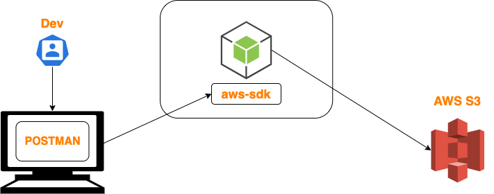

# Build API Server for upload files to AWS S3
[](https://github.com/ductnn/api-upload-to-s3/actions/workflows/ci.yml)
[](https://github.com/ductnn/api-upload-to-s3/pulls)
[](LICENSE)


<p align="center">
    
    <br><br> 
    <h3 align="center">Upload files to AWS S3 using simple API server with Nodejs by the hard way.</h3>
</p>

## Project structure

**Overview**:

```sh
.
├── ./src
├── ./Dockerfile
├── ./README.md
├── ./package-lock.json
├── ./package.json
└── ./tsconfig.json
```

**Detail**:

```sh
src
├── config
│   ├── config.ts
│   └── index.ts
├── main.ts
├── routes
│   ├── index.ts
│   └── upload-to-S3.ts
├── services
│   ├── api.ts
│   └── index.ts
└── utils
    ├── index.ts
    └── utils.ts
```

## Install and build

### With manual

Clone this repo:

```sh
git clone https://github.com/ductnn/api-upload-to-s3.git
cd api-upload-to-s3
```

Set the enviroment variables:

```sh
cp .env.example .env

# open .env and modify the environment variables
## AWS_ACCESS_KEY=
## AWS_SECRET_KEY=
## AWS_REGION_DEFAULT=
## AWS_BUCKET_NAME=
```

Install the dependencies:

```sh
npm install
```

Start API Server woth command `npm start`:

```sh
➜  api-upload-to-s3 git:(master) npm start 

> api-upload-to-s3@1.0.0 start
> node --require ts-node/register src/main.ts

Running service:  undefined
🚀 Server started as undefined at http://localhost:5000
```

Open url `127.0.0.1:5000` on browser to view result or use `curl`:

```sh
➜  api-upload-to-s3 git:(master) ✗ curl 127.0.0.1:5000
<h3>Build API Server for upload files to AWS S3</h3>
```

Then, we use **Postman** with method `PUT` in `127.0.0.1:5000/s3/upload` to 
upload files.

### With Dockerfile

Easy to build API with [Dockerfile](./Dockerfile):

```sh
# Build images
docker build -t <YOUR-DOCKER-ID>/api-upload-to-s3:v1 -f Dockerfile .

# Push to your registry
docker push <YOUR-DOCKER-ID>/api-upload-to-s3:v1

# And run this docker image
docker run -itd -p 5000:5000 <YOUR-DOCKER-ID>/api-upload-to-s3:v1
```

### Show your support
Give a ⭐ if you like this application ❤️

## Contribution
Contributions are more than welcome in this project!

## License
The MIT License (MIT). Please see [LICENSE](LICENSE) for more information.
